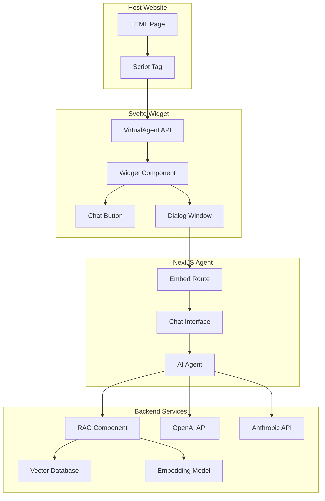

# Svelte Widget Wrapper

Pure Svelte 5 + Vite embeddable widget that compiles to a single `virtual-agent.js` file.

## Overview

This is **NOT** a SvelteKit application. It's a pure Svelte + Vite project configured to build a standalone widget that can be embedded in any website via a `<script>` tag.

## Architecture



## Build Output

```bash
npm run build
```

**Outputs:**
- `static/virtual-agent.js` - Standalone widget bundle (25KB, 10KB gzipped)
- `static/svelte-wrapper.css` - Widget styles (8.8KB, 2.6KB gzipped)

## Usage

### 1. Build the Widget

```bash
npm run build
```

### 2. Include in Your Website

```html
<!DOCTYPE html>
<html>
<head>
  <link rel="stylesheet" href="./static/svelte-wrapper.css">
</head>
<body>
  <h1>Your Website</h1>

  <!-- Load the widget -->
  <script src="./static/virtual-agent.js"></script>

  <!-- Initialize the widget -->
  <script>
    VirtualAgent.init({
      embedUrl: 'http://localhost:3000/embed',
      position: 'bottom-right',
      primaryColor: '#007bff',
      agentName: 'Virtual Assistant'
    });
  </script>
</body>
</html>
```

## Development

Start dev server with hot reload:

```bash
npm run dev
```

Opens at `http://localhost:5173`

## Configuration Options

```typescript
VirtualAgent.init({
  embedUrl: string;              // Required: URL to nextjs-agent /embed route
  position?: string;             // 'bottom-right' | 'bottom-left' | 'top-right' | 'top-left' (default: 'bottom-right')
  primaryColor?: string;         // Widget button color (default: '#007bff')
  secondaryColor?: string;       // Secondary color
  agentName?: string;            // Display name (default: 'Virtual Assistant')
  botIconUrl?: string;           // Custom bot icon
  size?: string;                 // 'small' | 'medium' | 'large'
  enableMinimize?: boolean;      // Show minimize button
  enableSound?: boolean;         // Sound notifications
  fullHeight?: boolean;          // Full height dialog mode (default: true)
  animation?: string;            // 'slide-left' | 'slide-right' | 'scale' | 'none' (default: 'slide-right')
});
```

## API Methods

```javascript
// Open the widget
VirtualAgent.open();

// Close the widget
VirtualAgent.close();

// Toggle widget visibility
VirtualAgent.toggle();

// Update configuration
VirtualAgent.updateConfig({ primaryColor: '#ff0000' });

// Destroy widget
VirtualAgent.destroy();
```

## Tech Stack

- **Svelte 5** - Component framework
- **Vite 7** - Build tool
- **TypeScript** - Type safety
- **Tailwind CSS v4** - Styling
- **ESLint + Prettier** - Code quality

## Project Structure

```
svelte-wrapper/
├── src/
│   ├── main.ts              # Entry point, exports global API
│   ├── Widget.svelte        # Main widget component
│   └── app.css              # Tailwind CSS
├── static/
│   ├── virtual-agent.js     # Compiled output (gitignored)
│   └── svelte-wrapper.css   # Compiled styles (gitignored)
├── index.html               # Dev server page
├── vite.config.ts           # Vite config (builds to virtual-agent.js)
└── package.json
```

## Build Configuration

The `vite.config.ts` is configured to:
- Build as an IIFE (Immediately Invoked Function Expression)
- Output to `static/virtual-agent.js`
- Expose global `VirtualAgent` object
- Inline all dependencies into single file

## Code Quality

Pre-commit hooks enforce:
- Max 300 lines per file
- Max 100 lines per function
- Cyclomatic complexity < 10
- Auto-formatting with Prettier
- Auto-linting with ESLint

## Why Not SvelteKit?

SvelteKit is for building full web applications with:
- Server-Side Rendering (SSR)
- File-based routing
- API routes
- Server components

For an embeddable widget, we need:
- Pure client-side code
- Single file output
- No server dependencies
- Small bundle size

## Scripts

```bash
npm run dev          # Start dev server
npm run build        # Build virtual-agent.js
npm run preview      # Preview production build
npm run check        # Svelte type checking
npm run check:watch  # Watch mode type checking
npm run lint         # Run ESLint
npm run lint:fix     # Fix ESLint issues
npm run format       # Format with Prettier
```
